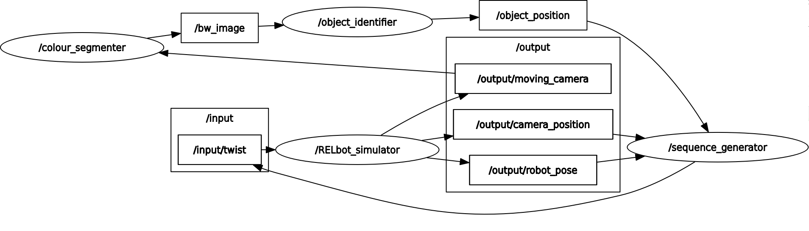

ASDFR1 Project
-----------------------------------------------
Description: This project uses a USB cam to send images to a ROS node, then extracts a bright object or a colored one then simulates following it.

The following graph describes the flow:
    

    
Students: 
    Belal ELshinnawey S3302245
    Nicholas Roy S3376044
